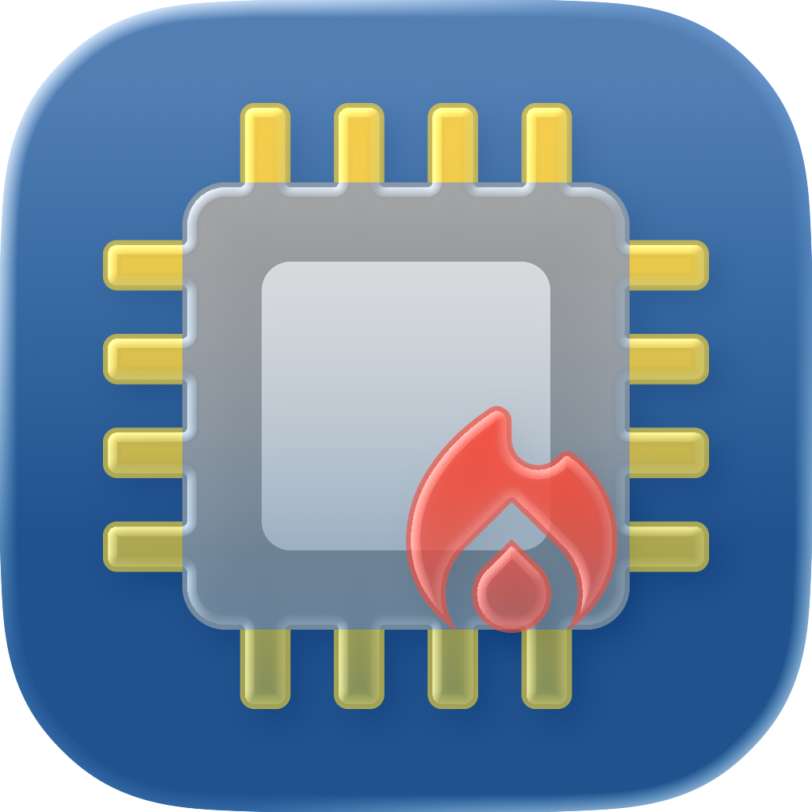

<p align="center">
  
</p>

<h1 align="center">Spin Doctor</h1>

<p align="center">
  A macOS menu bar app that watches for runaway processes hogging your CPU — and lets you kill them with one click.
</p>

---

Ever notice your Mac getting hot and loud for no apparent reason? Spin Doctor sits quietly in your menu bar, keeping an eye on CPU usage. When a process starts spinning out of control, you get a notification with the option to kill it right then and there.

- Detects processes sustaining high CPU usage over time
- Sends a notification with a **Kill** button when a process goes haywire
- Lists all currently busy processes in the menu bar dropdown
- Configurable thresholds, intervals, and ignore lists via `~/.config/spin_doctor/config.toml`
- Lightweight and unobtrusive — runs entirely in the menu bar

## Install

```bash
brew install --cask rileychh/tap/spin-doctor
```

Or download the latest DMG from [Releases](https://github.com/rileychh/spin-doctor/releases).

## License

[MIT](LICENSE)
